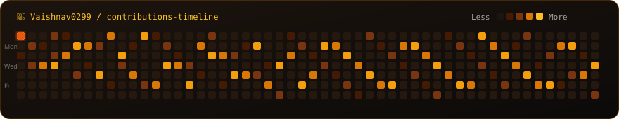

<!-- ⚡ Animated Banner (stored in assets/banner.svg) -->

  

 

<table align="center" border="0">
<tr>
<td width="45%" align="center" valign="middle">

<!-- 🖥️ Animated Terminal Card (stored in assets/terminal.svg) -->

</td>
<td width="55%" valign="middle">

### 👨‍💻 <b><code>About Me</code></b>

- 🎓 <b><code>Education</code></b> ➔ <b><code>B.E. Artificial Intelligence &amp; Data Science</code></b> · <i>Class of 2027</i>
- 💡 <b><code>Specialization</code></b> ➔ <b><code>Enterprise Full-Stack</code></b> · <b><code>Agentic AI</code></b> · <b><code>Distributed Systems</code></b>
- 💬 <b><code>Tech Focus</code></b> ➔ <b><code>React</code></b> · <b><code>Next.js</code></b> · <b><code>Node.js</code></b> · <b><code>Python</code></b> · <b><code>PostgreSQL</code></b> · <b><code>Docker</code></b> · <b><code>GenAI</code></b>
- 🚀 <b><code>Engineering Mission</code></b> ➔ <b><code>Architecting High-Concurrency Systems &amp; Production-Grade AI</code></b>
- 🌐 <b><code>Web Presence</code></b> ➔ 

 

</td>
</tr>
</table>

 

## 🛠️ <b><code>Tech Arsenal</code></b>

### 💻 <b><code>Frontend Engineering</code></b>

<table>
<tr>
<td align="center" width="90"> <b><code>HTML5</code></b></td>
<td align="center" width="90"> <b><code>CSS3</code></b></td>
<td align="center" width="90"> <b><code>JavaScript</code></b></td>
<td align="center" width="90"> <b><code>TypeScript</code></b></td>
<td align="center" width="90"> <b><code>React</code></b></td>
<td align="center" width="90"> <b><code>Next.js</code></b></td>
<td align="center" width="90"> <b><code>Tailwind</code></b></td>
</tr>
<tr>
<td align="center"> <b><code>Bootstrap</code></b></td>
<td align="center"> <b><code>Vite</code></b></td>
</tr>
</table>

### ⚙️ <b><code>Backend &amp; API Infrastructure</code></b>

<table>
<tr>
<td align="center" width="90"> <b><code>Node.js</code></b></td>
<td align="center" width="90"> <b><code>Express</code></b></td>
<td align="center" width="90"> <b><code>Hono</code></b></td>
<td align="center" width="90"> <b><code>Python</code></b></td>
<td align="center" width="90"> <b><code>FastAPI</code></b></td>
<td align="center" width="90"> <b><code>Flask</code></b></td>
<td align="center" width="90"> <b><code>GraphQL</code></b></td>
<td align="center" width="90"> <b><code>REST APIs</code></b></td>
</tr>
</table>

### 🗄️ <b><code>Databases &amp; ORM Architecture</code></b>

<table>
<tr>
<td align="center" width="90"> <b><code>PostgreSQL</code></b></td>
<td align="center" width="90"> <b><code>MongoDB</code></b></td>
<td align="center" width="90"> <b><code>MySQL</code></b></td>
<td align="center" width="90"> <b><code>SQLite</code></b></td>
<td align="center" width="90"> <b><code>Redis</code></b></td>
<td align="center" width="90"> <b><code>Drizzle</code></b></td>
<td align="center" width="90"> <b><code>Prisma</code></b></td>
</tr>
</table>

### 🤖 <b><code>AI &amp; Machine Learning Ecosystem</code></b>

<table>
<tr>
<td align="center" width="90"> <b><code>Scikit-Learn</code></b></td>
<td align="center" width="90"> <b><code>TensorFlow</code></b></td>
<td align="center" width="90"> <b><code>PyTorch</code></b></td>
<td align="center" width="90"> <b><code>Pandas</code></b></td>
<td align="center" width="90"> <b><code>NumPy</code></b></td>
<td align="center" width="90"> <b><code>Matplotlib</code></b></td>
<td align="center" width="90"> <b><code>Jupyter</code></b></td>
</tr>
<tr>
<td align="center"> <b><code>LangChain</code></b></td>
<td align="center"> <b><code>Ollama</code></b></td>
<td align="center"> <b><code>GenAI</code></b></td>
<td align="center"> <b><code>HuggingFace</code></b></td>
<td align="center">🧠 <b><code>LLM Engines</code></b></td>
</tr>
</table>

### 🧠 <b><code>Agentic AI &amp; Applied LLM Systems</code></b>

<table>
<tr>
<td align="center" width="110">⚡ <b><code>RAG Pipelines</code></b></td>
<td align="center" width="110">🤖 <b><code>LLM Workflows</code></b></td>
<td align="center" width="110">✍️ <b><code>Prompt Eng.</code></b></td>
<td align="center" width="110">🦾 <b><code>AI Agents</code></b></td>
<td align="center" width="110">🌐 <b><code>Multi-Agent</code></b></td>
<td align="center" width="110"> <b><code>Gemini API</code></b></td>
</tr>
</table>

### ☁️ <b><code>DevOps, Cloud &amp; Tooling</code></b>

<table>
<tr>
<td align="center" width="90"> <b><code>Docker</code></b></td>
<td align="center" width="90"> <b><code>AWS</code></b></td>
<td align="center" width="90"> <b><code>Git</code></b></td>
<td align="center" width="90"> <b><code>GitHub</code></b></td>
<td align="center" width="90"> <b><code>CI/CD</code></b></td>
<td align="center" width="90"> <b><code>Linux</code></b></td>
<td align="center" width="90"> <b><code>Postman</code></b></td>
<td align="center" width="90"> <b><code>Cloudflare</code></b></td>
<td align="center" width="90"> <b><code>Supabase</code></b></td>
</tr>
</table>

 

## 🚀 <b><code>Featured Deployments</code></b>

| 🎯 <b><code>Project</code></b> | 📝 <b><code>Architecture &amp; System Capabilities</code></b> | 🧰 <b><code>Stack</code></b> |
|:---|:---|:---:|
| 🎓 <a href="https://github.com/Vaishnav0299" target="_blank" rel="noopener noreferrer"><b><code>Education ERP System</code></b></a> | 🏢 <b>Enterprise Institutional ERP</b> engineered with <b>Role-Based Access Control (RBAC)</b>, attendance registries, dynamic exam administration, admissions pipelines &amp; academic-year schemas. | `React` `Node.js` `PostgreSQL` |
| 🤖 <a href="https://github.com/Vaishnav0299" target="_blank" rel="noopener noreferrer"><b><code>AI-Powered Applications</code></b></a> | 🧠 <b>Intelligent Systems Suite</b> integrating <b>Gemini API</b>, conversational context graphs, autonomous multi-step reasoning &amp; backend automation workflows. | `Python` `LLMs` `Gemini` `LangChain` |
| 🎉 <a href="https://github.com/Vaishnav0299" target="_blank" rel="noopener noreferrer"><b><code>Event Management Platform</code></b></a> | 🎟️ <b>Full-Stack Event Infrastructure</b> with <b>JWT Authentication</b>, organizer metrics dashboards, automated registrant passes &amp; resilient REST APIs. | `React` `Node.js` `MongoDB` |
| 📊 <a href="https://github.com/Vaishnav0299" target="_blank" rel="noopener noreferrer"><b><code>Data Science &amp; ML Projects</code></b></a> | 📈 <b>Predictive Modeling Toolkit</b> featuring exploratory data analysis (EDA), automated feature transformations, regression, classification &amp; statistical validation. | `Python` `Pandas` `Scikit-Learn` |
| 🧠 <a href="https://github.com/Vaishnav0299" target="_blank" rel="noopener noreferrer"><b><code>Generative AI Pipelines</code></b></a> | ⚡ <b>Autonomous Local AI Deployments</b> powered by <b>Ollama SLMs</b>, dense vector indexation, memory buffers &amp; agentic reasoning graphs. | `Ollama` `LLMs` `LangChain` |

 

## 📊 <b><code>Engineering Analytics</code></b>

<!-- Streak stats -->

  

<!-- Stats & Top Languages animated cards (stored in assets/stats.svg and assets/langs.svg) -->
<table align="center" border="0">
<tr>
<td></td>
<td></td>
</tr>
</table>

 

<!-- 📈 Contribution Activity Graph in molten gold & amber -->

  

<!-- 🐍 Contribution Snake (stored locally in assets/snake.svg) -->

## 🐍 <b><code>Contribution Velocity</code></b>

 

<blockquote align="center">
<h3>💡 <b><code>Developer Philosophy</code></b></h3>
<b><code>Build</code> ➔ <code>Break</code> ➔ <code>Learn</code> ➔ <code>Improve</code> ➔ <code>Repeat</code></b>
  
<i>"The most effective way to master technology is by <b>engineering real systems</b>, solving <b>hard problems</b>, and continuously raising the bar of excellence."</i>
</blockquote>

 

 

<b>⭐ <code>If you find my work interesting, feel free to explore and star my repositories!</code> 🚀</b>

